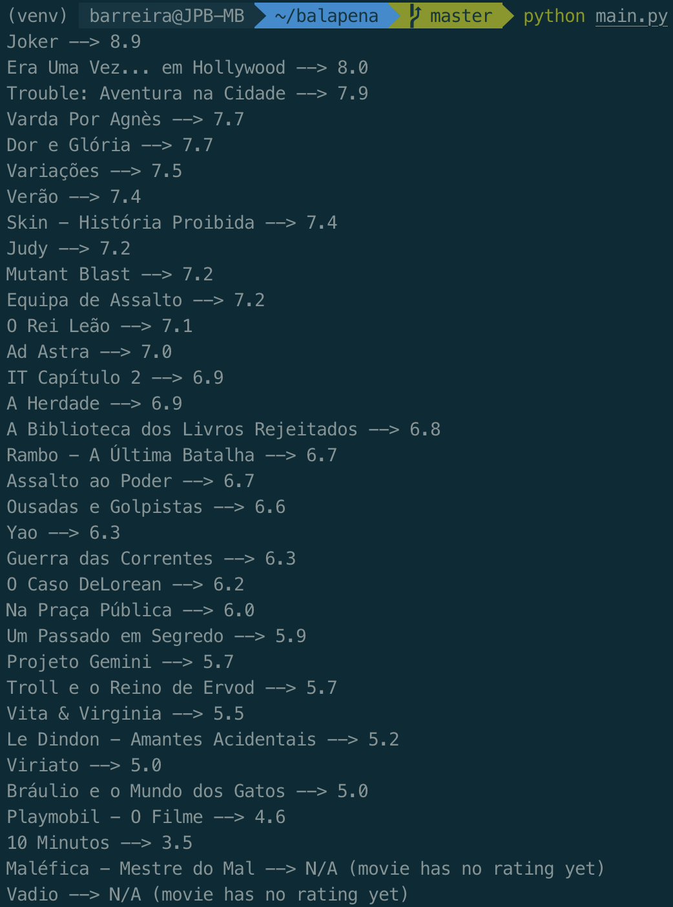

# Balapena: Vale a pena ir ao cinema?

Este programa faz scraping dos filmes disponíveis em http://cinemas.nos.pt/pages/cartaz.aspx e, através da biblioteca IMDbPY, imprime para o terminal os seus user ratings.

Serve para evitar ter de fazer o processo manual e entediante de copy paste dos nomes dos filmes (do site do cinema) para o IMDb, sempre que quero ir ao cinema.

### Funcionalidades a adicionar

- [x] ~~Ir buscar nomes dos filmes (web scraping)~~
- [x] ~~Ir buscar ratings dos filmes~~
- [ ] Utilizar diretamente a API do IMDb em vez da biblioteca IMDbPY (muito lenta?)
- [ ] Adicionar suporte a outros cinemas que não os da NOS (Cineplace, UCI)
- [ ] Permitir selecionar o cartaz a partir de uma lista de salas de cinema (ou cidades?)
- [ ] Apresentar isto tudo numa página web toda janota

&nbsp;

  
  <label align="center">(v1.0)</label>

